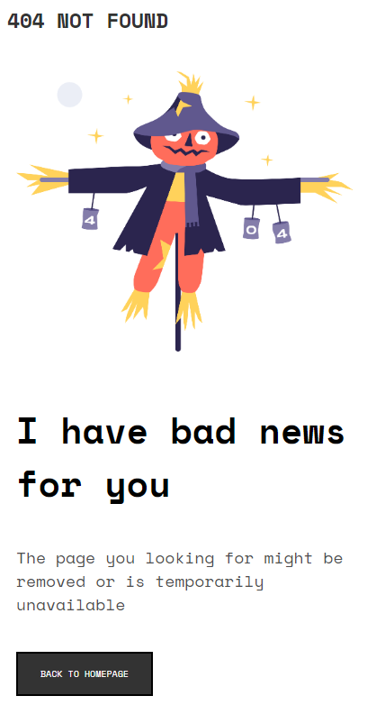
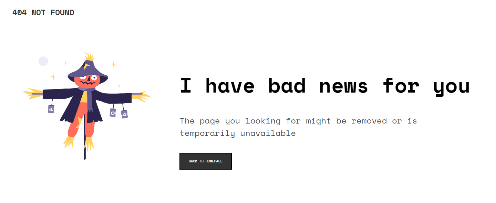

# Make It Real - 404 Not Found

This is the solution of the first mision of HTML and CSS about a 404 Not Found  exercise

## TABLE OF CONTENT

* [ Overview. ](#overview)
  * [ The Chalenge. ](#chalenge)
  * [ Screenshoot. ](#screenshoot)
* [ My process. ](#myProcess)
  * [Built with. ](#built)
  * [What I learned. ](#learned)
  * [Continued development. ](#continued)
  * [Useful resources. ](#resources)
* [ Author. ](#author)
* [Acknowledgments. ](#acknowledgments)


<a name="overview"></a>
## Overview
Users should be able to:

* Change the size of the site for desktop and mobile and see how it works properly in each size




<a name="myprocess"></a>
## My Process

I started with the HTML structure, then I made de styles to fit the requirements. I did mobile first design, and then, expanded it to desktop design using query params

### Built with

- Semantic HTML5 markup
- CSS custom properties
- Flexbox
- Mobile-first workflow


### What I learned

I learn about some propertis from CSS, like the variables in CSS. Normally in my personal proyects I don't use the querys, so this excercise help me to practice more this topics.
```

In this project we learn hoy to use medua queries and flexbox to desing a responsive mobile-first site.

```css
   @media screen and (min-width: 1440px) {
    body{
        margin: 20px 40px;
    }
    .container {
      display: flex;
      flex-direction: row;
      justify-content: center;
      padding: 100px 30px;
    }
```
### Continued development
We need to continue learning about how flexbox works and about responsive desing
### Useful resources
- [Resource 1](https://www.w3schools.com/css/css3_mediaqueries.asp) - This helped me to see the syntax of media queries.
- [Resource 2]([https://www.example.com](https://platzi.com/blog/flexbox-explicado-con-manzanitas/?utm_source=google&utm_medium=cpc&utm_campaign=17739691128&utm_adgroup=&utm_content=&gclid=CjwKCAjwqJSaBhBUEiwAg5W9p6VmJgCRt2q92c9ZP8YdFUVlTVBgXbzODawazBUG9S8lCL1OBbYdkRoCiKEQAvD_BwE&gclsrc=aw.ds)) - This is an amazing article which helped me to undestand Flexbox in an easy way.
## Author
- Laura Manuela Esmoris
## Acknowledgments
Thanks to Juan Sebastián, my partner in this project and the teacher Cristian Moreno.